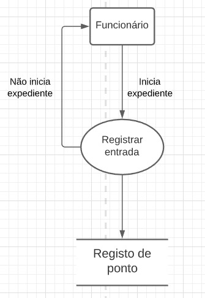

# Descrição dos Processos de Negócio

#### Atender Cliente

__Evento:__ Cliente entra em contato
__Objetivo:__ Cliente contratar um serviço
__Trabalhadores Envolvidos:__ Atendente

- Verifica se o cliente está cadastrado no sistema.
- Verifica se o serviço solicitado pode ser realizado.

-------------------------------------------------------------
#### Entender Projeto

__Evento:__ Cliente apresenta projeto
__Objetivo:__ Empresa entender projeto e avaliar.
__Trabalhadores Envolvidos:__ Área de Negócios

- Entende o projeto apresentado pelo cliente
- Verifica se o projeto é viável
- Válida projeto.

-------------------------------------------------------------
#### Analisar Escopo

__Evento:__ Cliente apresenta escopo do projeto
__Objetivo:__ Validar se escopo está em conformidade.
__Trabalhadores Envolvidos:__ Área de Análise

- Receber o escopo do projeto
- Validar e definir escopo do projeto.
- O escopo pode ser recusado caso haja problemas de entendimento de ambas as partes quanto ao projeto

-------------------------------------------------------------
#### Analisar Requisitos

__Evento:__ Cliente apresenta documento de requisitos do sistema
__Objetivo:__ Verificar se os requisitos do sistema estão válidos.
__Trabalhadores Envolvidos:__ Área de Análise

- Recebe os requisitos do cliente
- Verifica se possui cadastro dos requisitos na base de dados
- Os requisitos podem ser recusados caso haja divergência, não concordância ou problemas nas informações	

-------------------------------------------------------------
#### Programar Sistema

__Evento:__ Gerente da empresa atribui demanda ao programador
__Objetivo:__ Desenvolver sistema
__Trabalhadores Envolvidos:__ Área de Desenvolvimento

- Após passar pela área de análise, o Gerente atribui tarefas para a área de desenvolvimento.
- As tarefas são realizadas para o sistema.
- As tarefas realizadas resultam no sistema desejado

-------------------------------------------------------------
#### Comprar Material

__Evento:__ Empresa  necessita de materiais
__Objetivo:__ Comprar material para empresa
__Trabalhadores Envolvidos:__ Área Comercial

- É recebida a demanda de compra de materiais.
- Os materiais são comprados para suprir demanda

-------------------------------------------------------------

#### Gerar Relatórios

__Evento:__ Cliente solicita relatórios
__Objetivo:__ Gerar Relatórios
__Trabalhadores Envolvidos:__ Área Administrativa

- Há a demanda de emissão dos relatórios
- Os relatórios são exportados dos dados cadastrados.

-------------------------------------------------------------

#### Contratar Funcionário

__Evento:__ Empresa abre vagas de estágio
__Objetivo:__ Contratar funcionário
__Trabalhadores Envolvidos:__ Área de RH

- Empresa possui muitas demandas e para suprir as demandas, necessita de mais funcionários
- RH abre vaga de emprego
- Funcionários contratados são cadastrados
    - Candidato não é contratado, pois não se adequa a vaga oferecida

-------------------------------------------------------------
#### Registrar Entrada

__Evento:__ Funcionário inicia expediente
__Objetivo:__ Registrar entrada
__Trabalhadores Envolvidos:__ Funcionários

- O expediente é iniciado quando o funcionário entra na empresa
- O registro do ponto é feito e registrado
    - Caso tenha problemas de registro o mesmo não é realizado e deve ser feito novamente
    - Caso o funcionário falte no dia, ele não precisa registrar entrada

-------------------------------------------------------------
#### Registrar Saída

__Evento:__ Funcionário finaliza expediente
__Objetivo:__ Registrar saída
__Trabalhadores Envolvidos:__ Funcionários

- Após cumprir a carga horária estabelecida, o funcionário encerra o expediente
- Encerrando o expediente, o funcionário registra saída

-------------------------------------------------------------
#### Registrar Atividades

__Evento:__ Funcionário realiza atividades do dia
__Objetivo:__ Registrar atividade dodia
__Trabalhadores Envolvidos:__ Funcionários

- Após cumprir a carga horária estabelecida, o funcionário registra as atividades realizadas no dia, incluindo quantas horas trabalhadas nessa atividade

-------------------------------------------------------------
