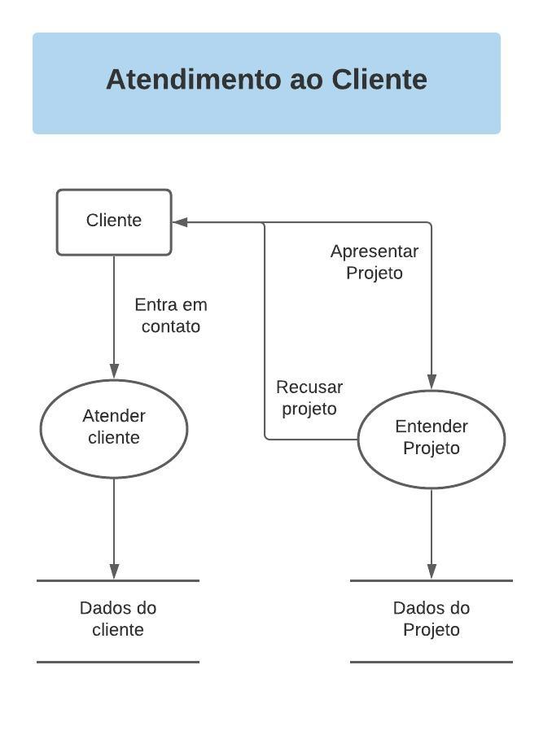
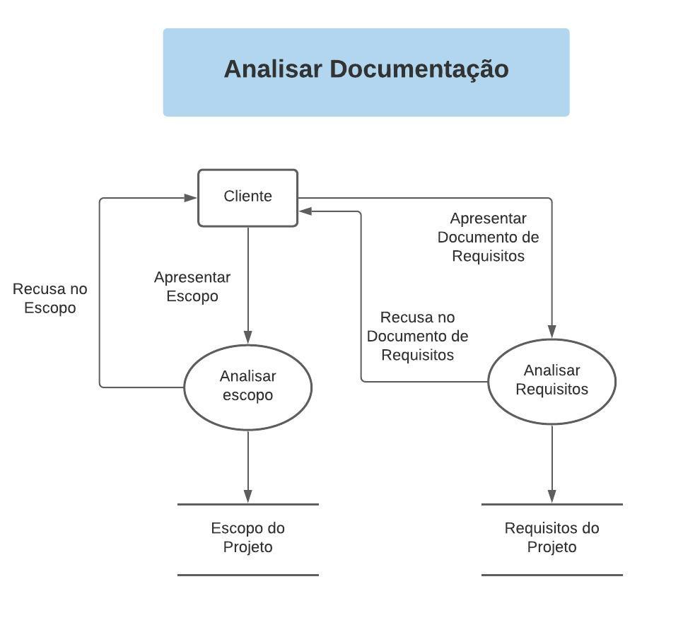
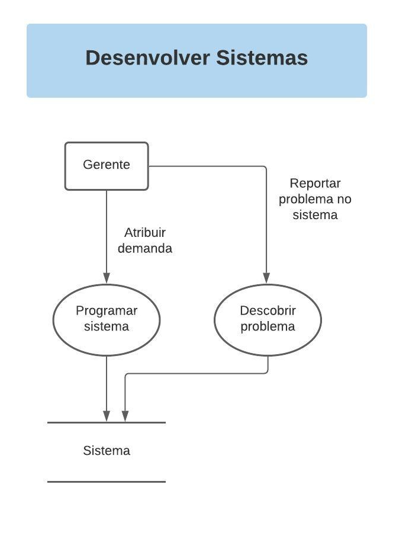
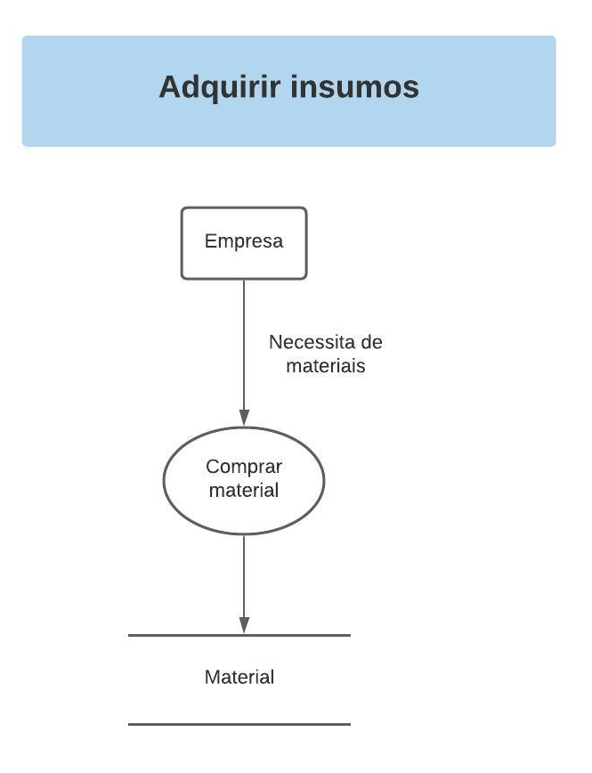
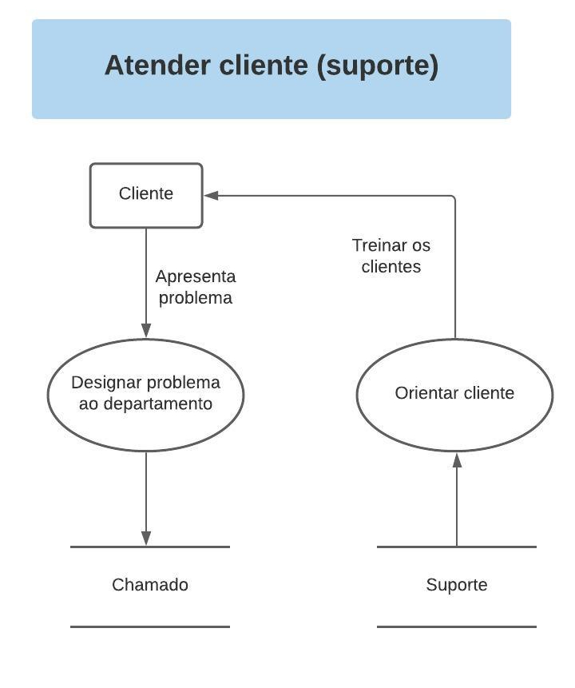
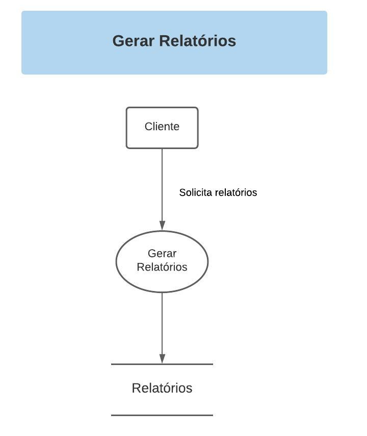
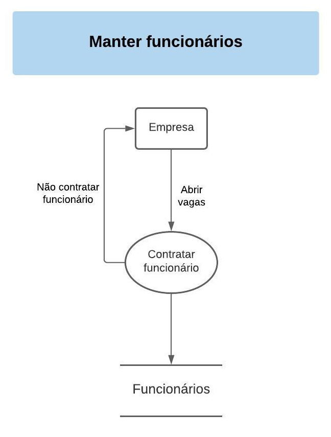
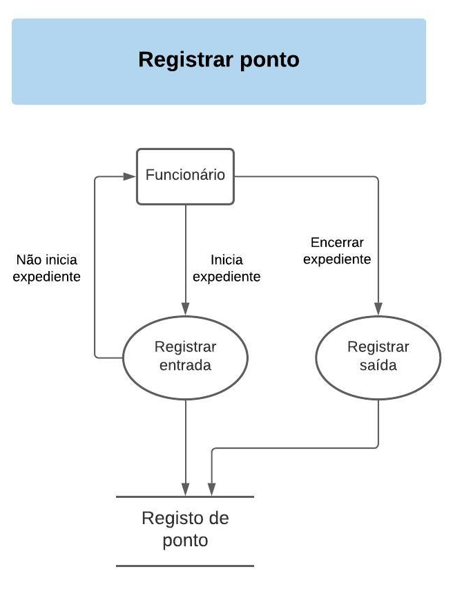
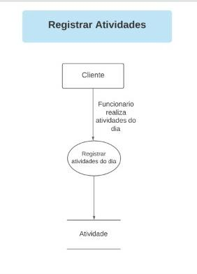

# Regras de Negócio

__RN-001:__ O cliente entra em contato com a empresa (por email, telefone, ou pessoalmente)
__RN-002:__ O departamento responsável da empresa, atende o cliente, tendo o primeiro contato entre cliente e empresa.
__RN-003:__ A empresa recolhe os dados desse cliente, gerando uma base de dados de clientes.
__RN-004:__ Seguindo o cronograma de reuniões, o cliente apresenta o projeto para a empresa.
__RN-005:__ A empresa entende o projeto e avalia a viabilidade de aceitar o projeto.
__RN-006:__ A empresa recusa ou aceita o projeto, resultando em uma base inicial de dados do projeto.

__RN-007:__ Cliente apresenta o escopo para avaliação.
__RN-008:__ O departamento responsável analisa o escopo.
__RN-009:__ O departamento pode aceitar ou recusar o escopo sugerindo melhorias.
__RN-010:__ O cliente apresenta escopo novamente, até que seja aceito pelo departamento.
__RN-011:__ O departamento aceita o escopo.
__RN-012:__ O processo resulta do escopo do projeto. 
__RN-013:__ Cliente apresenta o documento de requisitos para avaliação.
__RN-014:__ O departamento responsável analisa o documento de requisitos.
__RN-015:__ O departamento pode aceitar ou recusar os requisitos sugerindo melhorias.
__RN-016:__ O cliente desenvolve e apresenta o documento de requisitos novamente, até que seja aceito pelo departamento.
__RN-017:__ O departamento aceita o documento de requisitos do projeto.
__RN-018:__ O processo resulta no documento de requisitos do projeto.. 

__RN-019__: Gerente atribui demandas para desenvolver aplicações.
__RN-020__: Desenvolvedores implementam demandas no sistema.
__RN-021__: O processo resulta no sistema que o cliente vai adquirir.
__RN-022__: Se houver problemas ou bugs na aplicação, o gerente deve reportar o problema para os desenvolvedores.
__RN-023__: Desenvolvedores recebem detalhes referente ao erro e implementam ajustes no sistema.
__RN-024__: O processo resulta em um sistema melhorado, sem erros de implementação. 

__RN-025:__ Empresa tem necessidade de compras de materiais.
__RN-026:__ Quando localizado o melhor produto, preço e fornecedor a compra é realizada.

__RN-027:__ Cliente entra em contato e apresenta o problema.
__RN-028:__ O departamento analisa o problema e abre um chamado.
__RN-029:__ Suporte orienta e treina os clientes a como usar o sistema.

__RN-030:__ Cliente solicita relatórios do projeto.
__RN-031:__ De acordo com a base de dados obtida na capacidade 
__RN-032:__ Gerente reúne os relatórios e entrega ao cliente.

__RN-033:__ Empresa tem necessidade de novas vagas na empresa e assim abre novas vagas.
__RN-034:__ Com a devida demanda e processo seletivo, há a contratação de funcionários.
__RN-035:__  A contratação pode não ocorrer por motivos técnicos ou até mesmo pessoais.

__RN-036:__ Funcionário inicia o expediente e registra o horário de entrada
__RN-037:__ Funcionário não inicia o expediente e não registra o horário de entrada
__RN-038:__ Funcionário encerra o expediente e registra o horário de saída.

__RN-039:__ Funcionário faz suas tarefas do dia.
__RN-040:__ Funcionário registra atividades realizadas no dia.

